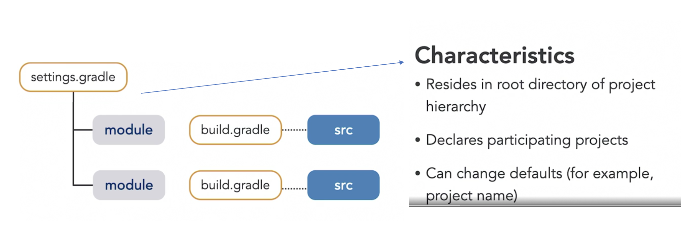

# Gradle Notes

These are some notes I took from the LinkedIn Learning courses
[Learning Gradle](https://www.linkedin.com/learning/learning-gradle/automate-everything?u=2094516)
and
[Gradle for Java-Based Applications and Libraries](https://www.linkedin.com/learning/gradle-for-java-based-applications-and-libraries/what-you-should-know?u=2094516)
by Benjamin Mushko.

# Learning Gradle Course
## Chapter 1 - Getting Started
### What is Gradle?
Gradle is a "build automation" tool. "Build" can include:
- Compiling the source code
- Running tests
- Building binary artifacts.
- Generating technical documentation.

Gradle can be used to automate the software lifecycle apps in different
programming languages like: Java Android, Go, Python, Java, Kotlin, etc.

### Characteristics and features
- Gradle runs on the Java virtual machine.
- The build logic is defined as instruction scripts.
- There are multiple gradle plugins that you can use to provide
  predefined functionality.
- It is primarily a command line tool but there extensive support for it
  in IDEs.
- Gradle is also widely supported by CI tools like Jenkins, GitHub
  Actions, among others.

### Gradle Terminology
- Software Component: A piece of software that is internally modularized
  and structured using gradle projects.
  - For example a micro-services would be a Software Component. The
    microservice can be internally modularized using multiple gradle
    projects.
  - If you don't want to have internal boundaries within your software
    component, then the software component = gradle project.
- Gradle Project: the core of every gradle build. Marks the capabilities
  and boundaries of a software project.
- Build file / script: Each project should have its own build file. This
  file is typically name `build.gradle` (Groovy) or `build.gradle.kts`
  (Kotlin).
- Tasks: The step-by-step automation instructions to build a project.
  You write tasks in the build script. Tasks ara a unit of work.
- This means that the conceptual model is:
  - A software component is called a `Project`.
  - One `Project` has one to many `Tasks`.
  - One `Task` has zero to many `Actions`.

### Expressing Build Login in Gradle
- Gradle defines a DSL API that can be mixed with regular programming
  code.
- The DSL comes in two flavours: Groovy DSL and the Kotlin DSL. Both are
  equivalent, and you can pick whichever you prefer.

### Working with multiple Gradle Versions
- A project typically uses a fixed gradle version.
- Gradle's API can include breaking changes between major versions.
- When you want to upgrade the gradle version for a project, you will
  need to update the Gradle runtime and potentially update your scripts
  to reflect the new API.

### The Gradle Wrapper: Working with multiple projects that have different Gradle Versions
- The Gradle Wrapper is the solution for the problem of maintaining on
  the same local machine multiple gradle projects that use different
  gradle versions.
- The wrapper is a shell script (also available in bat for Windows) that
  is checked into the project and will automatically download the
  correct version of gradle for a project (if not installed) or load the
  correct version of gradle (if multiple are locally installed) before
  running any commands given to the wrapper.
- The wrapper looks into the `./gradle/*` directory in your project to
  look for the version the project should use. This folder must also be
  checked into version control with the wrapper.
- To GENERATE the wrapper scripts (`gradlew` and `gradlew.bat`) and the
  `./gradle/*` directory, you can run `gradle wrapper` in the root of
  your project directory.
  - The machine that does this for the first time in a project needs to
    have the correct version of gradle locally available. All other
    developers can just use `./gradlew` to get everything setup for
    them.
  - IntelliJ takes care of this if you start a new project, or a new
    module using the `Gradle` option.
- If using the terminal to invoke gradle, invoke the tasks through the
  `./gradlew` instead of calling it directly.
  - For example `./gradlew build`
- The gradle wrapper mode of operation also works within continuous
  delivery servers. That is, the wrapper will download the correct
  version of gradle if not installed.


### Executing Gradle from the IntelliJ IDEA
- IDEA relies on the `gradlew`, and the `./gradle/` directories to enable
  IDE support for gradle.
- If IDEA finds those files, it will inspect the build files and load
  all tasks into the gradle tab on the right side.
- When gradle is properly detected by IDEA, we get autocompletion with
  the Gradle DSL when editing the `build.gradle`, or the
  `build.gradle.kts` files.

## Chapter 2 - Gradle Essentials

### Build and file conventions
- Gradle automatically derives the project name from the directory.
  - If you want to manually set this, you can do `rootProject.name =
    "1-hello-world"` in the `settings.gradle.kts` file.
  - See `1-hello-world/settings.gradle.kts`.

#### Typical directory structure of a multi-project / multi-module build

IMPORTANT: Gradle has a very clear distinction on how to handle a single
*software component* which is structured internally with *multiple
projects __(which conceptual map to IntelliJ IDEA modules)__*, from a
*software product* that is made of orchestrating *multiple software
components*. In this section we are talking about the former.
[See the documentation for more information.](https://docs.gradle.org/current/userguide/multi_project_builds.html)


- Gradle prescribes how to structure the source files of a multi-project
  software component.
- In a multi-project component, each module must contain its
  `build.gradle.kts` file at the root of the module.
- Additionally, the root of directory that holds must contain a
  `settings.gradle.kts` in which all participating projects in the
  component get declared.

#### The `gradle.properties` file
- Resides in the root directory of your project hierarchy or in the
  Gradle user home directory.
  - By user home we mean `~/.gradle/gradle.properties`. These properties
    will be applied to all gradle builds for the local machine.
- `gradle.properties` defines runtime options for your build (from a set
  of predefined configurable options).
- It also allows you to set custom key value pairs that you can later
  access to customize your build.
- See the `1-hello-world` module for an example on how to use this.

### Defining and configuring a task

#### Ad Hoc Tasks
- Good fit for a one-off simple actions by adding code into `doFirst` or
  `doLast` actions.

#### Typed Tasks
- Better fit for more complex task logic.
- Our custom typed tasks make use of other higher level tasks provided
  by Gradle (e.g `Copy, Zip, etc`).
- We don't necessarily have to code the action details as the higher
  level tasks we use provide APIs that probably do much of what we need.
  - In our code we typically set property values or call methods from
    the higher level task.

```kotlin
tasks.register<Copy>("myCopyTask") {
    from(layout.projectDirectory.dir("src"))
    into(layout.buildDirectory.dir("docs"))
    include("**/*md")
    includeEmptyDirs = false
}
```

### Task dependencies
A dependency can be defined with the `dependsOn` method.
```kotlin
tasks.register<Zip>("zipDocs") {
    dependsOn(tasks["myCopyTask"])
    from(layout.buildDirectory.dir("docs"))
    archiveFileName.set("docs.zip")
    destinationDirectory.set(layout.buildDirectory.dir("dist"))
}
```
#### The Directed Acyclic Graph (DAG)
- Dependent tasks in gradle form a DAG with tasks being the nodes of the
  graph.
- The DAG CANNOT have cycles. Gradle will fail the build if a cycle is
  detected.
- In Gradle, the execution order of parallel tasks is not guaranteed
  (i.e. it does not follow the declaration order in the task code).
  - For example, if `A --> B and A --> C`, there is no guarantee on
    which task `B` or `C` will run first.
  - To force a run order we can:
    - Declare an extra dependency (e.g. `C --> B`) to ensure that `B` runs
      before `C`.
    - There are other methods for finer grained order control like using
      `mustRunAfter` (see docs more info).
- By default, Gradle does not provide a way to visualize the resulting
  DAG.
  - The next best thing to do without installing anything else is to
    print the names of all the tasks that will get run without running
    them using the `--dry-run` option
    - e.g. `./gradlew zipDocs --dry-run`
  - Alternatively, you can install the
    [Gradle task tree plugin](https://github.com/dorongold/gradle-task-tree)
    which allows you to render the tasks as a tree.

## Other useful commands
- `./gradlew tasks --all` lists all tasks available for the gradle
  project.
